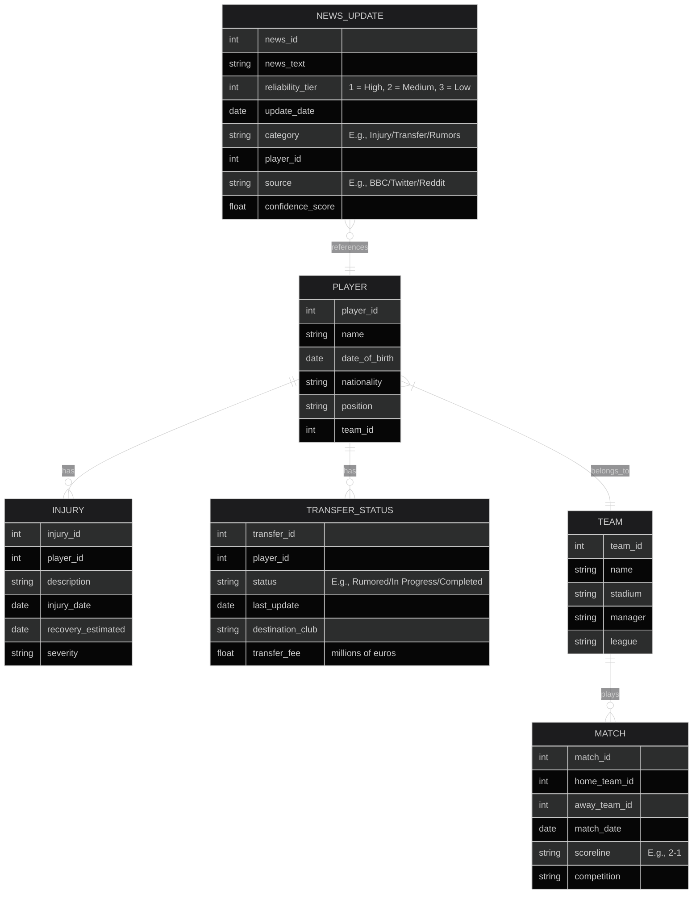

# N17 Dashboard

A comprehensive dashboard system for tracking Tottenham Hotspur squad, transfers, injuries, and news updates using AI-powered data processing.

## System Overview

### Data Pipeline

1. **Player/Team API Sources**
   - API-football for Squad and player database
   - Club website RSS feed for official announcements

2. **News Monitoring**
   - r/coys for news about players and related updates

3. **AI Processing Layer**
   - NLP model (GPT-4/Claude 3) to analyze text snippets and:
     - Classify updates (Injury/Transfer/Contract/Rumors)
     - Reliability of source (from tier listed on reddit site)
     - Extract entities (players, clubs, dates)
   - Maintain update history with confidence scores

## Core System Components

### Database Schema



### Automation
- Celery beat scheduler for:
  - News checks at a configurable interval
  - Daily API syncs
  - Injury status expiration checks
  - Transfer rumor timeouts (auto-archive stale rumors)

### Frontend
- Pretty, simplistic JavaScript frontend
- Dashboard style layout
- Key Elements:
  - Squad table
  - Linked players table
  - News updates table
  - Competitions table
  - Upcoming games table

## Project Structure

```
n17-dash/
├── backend/
│   ├── app/
│   │   ├── __init__.py
│   │   │   ├── models/              # Database models
│   │   │   │   ├── __init__.py
│   │   │   │   ├── player.py
│   │   │   │   ├── team.py
│   │   │   │   ├── injury.py
│   │   │   │   ├── transfer.py
│   │   │   │   ├── match.py
│   │   │   │   └── news.py
│   │   │   ├── db/                  # Database connection
│   │   │   │   ├── __init__.py
│   │   │   │   └── session.py
│   │   │   ├── pipeline/            # Data ingestion pipeline
│   │   │   │   ├── __init__.py
│   │   │   │   ├── api_clients/     # API integrations
│   │   │   │   │   ├── football_api.py
│   │   │   │   │   └── club_rss.py
│   │   │   │   ├── news_monitoring/ # News collectors
│   │   │   │   │   ├── reddit_scraper.py
│   │   │   │   │   └── twitter_client.py
│   │   │   │   └── ai_processing/   # NLP layer
│   │   │   │       ├── classifier.py
│   │   │   │       ├── entity_extractor.py
│   │   │   │       └── reliability_scorer.py
│   │   │   ├── tasks/               # Celery tasks
│   │   │   │   ├── __init__.py
│   │   │   │   ├── news_tasks.py
│   │   │   │   ├── api_sync.py
│   │   │   │   └── maintenance.py
│   │   │   ├── api/                 # Web API routes
│   │   │   │   ├── __init__.py
│   │   │   │   ├── routers/
│   │   │   │   │   ├── players.py
│   │   │   │   │   ├── transfers.py
│   │   │   │   │   ├── news.py
│   │   │   │   │   └── matches.py
│   │   │   │   └── dependencies.py
│   │   │   ├── utils/               # Helpers
│   │   │   │   ├── config.py
│   │   │   │   ├── logger.py
│   │   │   │   └── validation.py
│   ├── tests/                   # Test suite
│   │   ├── unit/
│   │   └── integration/
│   ├── Dockerfile
│   ├── requirements.txt
│   ├── server.py               # FastAPI entry point
│   └── celery_worker.py        # Celery entry point
├── frontend/
│   ├── static/                 # CSS/JS/Images
│   ├── templates/              # HTML templates
│   └── src/                    # JS source files
│       ├── dashboard.js        # Main dashboard logic
│       ├── squad-table.js      # Squad table component
│       └── news-feed.js        # News update component
├── docker-compose.yml          # Orchestration
├── .env                        # Environment variables
└── README.md
```

## Key File Relationships

### 1. Data Flow
- `tasks/news_tasks.py` → Triggers `pipeline/news_monitoring/reddit_scraper.py`
- Scraped news → Passed to `ai_processing/classifier.py`
- Processed results → Stored via `models/news.py`
- API clients (`api_clients/football_api.py`) → Update core models

### 2. AI Integration
- `ai_processing/classifier.py` uses GPT-4/Claude for:
  - News classification (injury/transfer/etc)
  - Entity extraction linked to `models/player.py`
- `reliability_scorer.py` combines source tier and AI confidence

### 3. Automation
- Celery tasks scheduled in `tasks/__init__.py`
- Maintenance tasks in `tasks/maintenance.py` handle:
  - Archiving stale transfer rumors
  - Expiring old injuries
  - Cleaning low-confidence news

### 4. API Layer
- FastAPI routers expose data to frontend:
  - `/api/players` → `routers/players.py`
  - `/api/news` → `routers/news.py`
- All routes use SQLAlchemy models for DB access

### 5. Frontend Integration
- Static JS files in `frontend/src/` fetch from API endpoints
- Dashboard.js coordinates table updates
- Auto-refresh mechanism polls API endpoints periodically

## Execution Flow

### 1. Scheduled Tasks (Celery Beat)
- Regular news checks → Process updates → Store in DB
- Daily API syncs update player/team/match data
- Nightly maintenance cleans up old data

### 2. User Interaction
- Browser loads frontend → Fetches initial data from API
- JS components render tables/charts
- WebSocket/Polling updates for real-time changes

### 3. Data Validation
- `utils/validation.py` sanitizes all inbound data
- AI processing includes confidence scores for manual review

## Expansion Points

1. Add new data sources by:
   - Creating new clients in `pipeline/api_clients/`
   - Adding corresponding Celery tasks

2. Add new UI components by:
   - Creating new JS modules in `frontend/src/`
   - Adding API endpoints in `api/routers/`

3. Improve AI processing by:
   - Modifying `ai_processing` modules
   - Adding new training data/classification categories

## Tech Stack

- **Backend**: FastAPI + SQLAlchemy + Celery + PostgreSQL
- **Frontend**: HTMX + React
- **AI**: LangChain + OpenRouter APIs
- **Infrastructure**: Docker + Redis (for Celery) + Apache
